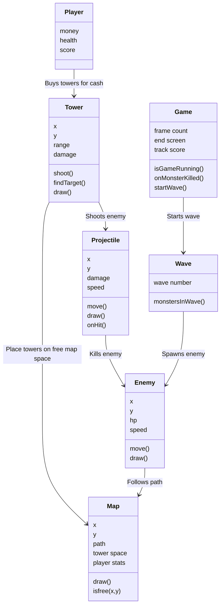

```mermaid
classDiagram

 

class Tower {

    x

    y

    range

    damage

    shoot()

    findTarget()

    draw()

}

 

class Enemy {

    x

    y

    hp

    speed

    move()

    draw()

}

 

class Game{

    frame count

    end screen

    track score

    isGameRunning()

    onMonsterKilled()

    startWave()


}

class Player{

    money

    health

    score

}

class Map{

    x

    y

    path

    tower space

    player stats

    draw()

    isfree(x,y)


}

class Projectile{

    x

    y

    damage

    speed

    move()

    draw()

    onHit()

}

class Wave{

    wave number

    monstersInWave()

}

Game --> Wave : Starts wave

Wave --> Enemy : Spawns enemy

Player --> Tower : Buys towers for cash

Tower --> Map : Place towers on free map space

Enemy --> Map : Follows path

Tower --> Projectile : Shoots enemy

Projectile --> Enemy : Kills enemy


```